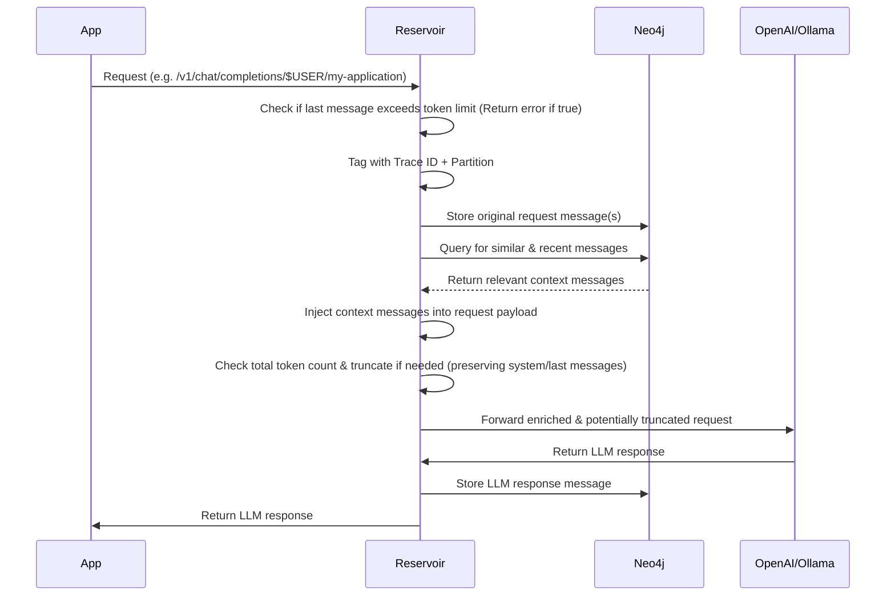

# Reservoir


## Abstract

Reservoir is a stateful proxy server for OpenAI-compatible Chat Completions APIs. It maintains conversation history in a Neo4j graph database and automatically injects relevant context into requests based on semantic similarity and recency.


## Problem Statement

OpenAI-compatible Chat Completions APIs are stateless. Each request must include the complete conversation history for the model to maintain context. This creates several problems:

1. Manual conversation state management
2. Token limit constraints as conversations grow
3. Inability to reference semantically related conversations
4. No persistent storage of conversation data

## Solution

Reservoir acts as an intermediary that:

- Stores all messages in a Neo4j graph database
- Computes embeddings using BGE-Large-EN-v1.5 (current default)
- Creates semantic relationships (synapses) between similar messages
- Automatically injects relevant context into new requests
- Manages token limits through intelligent truncation

## Architecture



## Supported Providers

- OpenAI (gpt-4, gpt-4o, gpt-3.5-turbo)
- Ollama (local models)
- Mistral AI
- Google Gemini
- Any OpenAI-compatible endpoint

## Data Model

Conversations are stored as a graph structure:
- **MessageNode**: Individual messages with embeddings
- **EmbeddingNode**: Vector representations for semantic search
- **SYNAPSE**: Relationships between semantically similar messages
- **RESPONDED_WITH**: Sequential conversation flow
- **HAS_EMBEDDING**: Message-to-embedding associations

## Semantic Relationships

Reservoir creates synapses between messages when cosine similarity exceeds 0.85. This enables:
- Cross-conversation context injection
- Topic thread identification
- Semantic search capabilities


## Usage

Replace OpenAI API endpoint:
```
https://api.openai.com/v1/chat/completions
```

With Reservoir endpoint:
```
http://127.0.0.1:3017/partition/$USER/instance/reservoir/v1/chat/completions
```

The system organizes conversations using a partition/instance hierarchy for multi-tenant isolation.

## Implementation

Start server:
```bash
cargo run -- start
```

The server initializes a vector index in Neo4j and listens on port 3017.

## Documentation

Technical documentation is available at [sectorflabs.com/reservoir](https://sectorflabs.com/reservoir/).

Local documentation can be built with:
```bash
make book
```

## Reference Implementation

A reference talk demonstrating the system architecture:
[](https://youtu.be/oNc2ljo_BwU?si=b9Th_Pt5e6qllI0W)

## License

BSD 3-Clause License
