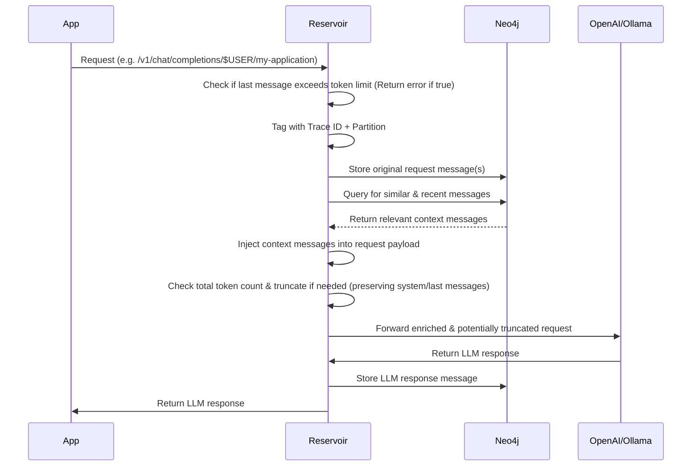

# Reservoir

## What is Reservoir?

Reservoir is your helpful memory for AI conversations. It sits between your app and any OpenAI-compatible Chat Completions API, making it easier to have rich, ongoing conversations with your favorite language models from multiple providers.

### Why does this matter?

When you use any [OpenAI-compatible Chat Completions API](https://platform.openai.com/docs/guides/chat), you need to send the full conversation history with every request. For example:

```json
[
  {"role": "user", "content": "What is 1 + 1?"},
  {"role": "assistant", "content": "2"},
  {"role": "user", "content": "What is the answer times 3?"}
]
```

If you only send the last question, the model won't know what "the answer" refers to. You have to keep track of all previous messages and include them every time.

**This can get tricky as conversations grow!**

Reservoir acts as a smart proxy: it automatically stores your chat history and inserts the right context into each request. You just talk to any OpenAI-compatible API as usual and Reservoir handles the memory, context, and even finds other relevant messages from your past conversations to help the model give better answers.

**Supported Providers:**
- OpenAI (GPT-4, GPT-4o, GPT-3.5-turbo, etc.)
- Ollama (llama3.2, gemma3, and any local models)
- Mistral AI (mistral-large-2402, etc.)
- Google Gemini (gemini-2.0-flash, etc.)
- Any OpenAI-compatible API endpoint

- No more manual history management
- Automatic context enrichment
- Your data stays private and local

### Use Reservoir with Multiple Apps

You can point multiple apps or clients to a single Reservoir instance. This means you can keep context and history across different tools on your computer—like your terminal, a web app, or a chat client. If you want to keep conversations separate, you can use Reservoir's partitioning feature to organize chats by app, project, or any context you choose.

## Why Use Reservoir?

- **Own your AI history**: All your conversations are stored locally, never in the cloud.
- **Search and recall**: Instantly find previous chats, ideas, or code snippets from your AI interactions.
- **Enrich context**: Automatically inject relevant history into new prompts for more coherent, personalized responses.
- **Visualize conversations**: See how your discussions branch and connect over time.
- **Stay private**: Your data never leaves your device.


Reservoir lets you have conversations with multiple AI models and providers, all while keeping your data private and local. Every interaction is stored on your device, building a personal knowledge base that never leaves your network. A single thread of conversation can span multiple models without losing context, allowing you to seamlessly switch between different AI providers while maintaining the flow of your discussion.

### Talks
[](https://youtu.be/oNc2ljo_BwU?si=b9Th_Pt5e6qllI0W)

**Advanced Features:**
- **Web Search Integration**: Pass `web_search_options` to enable AI models with web search capabilities
- **Multi-Provider Routing**: Automatically routes requests to the correct provider based on model name
- **Token Management**: Smart truncation to stay within model limits while preserving context
- **Flexible Configuration**: Environment variables for custom provider endpoints

## Table of Contents

- [Overview](#overview)
- [Conversation Threads via Synapses](#conversation-threads-via-synapses)
- [Documentation](#documentation)
- [Quick Start](#quick-start)
- [License](#license)

## Overview

Reservoir intercepts your API calls, enriches them with relevant history, manages token limits, and then forwards them to the actual LLM service.



This sequence diagram provides a high-level overview of how Reservoir processes requests and responses.

## Conversation Threads via Synapses

Reservoir uses synapse relationships to create "threads" of semantically related messages within the conversation graph. As messages are added, synapses link them sequentially, forming a continuous flow. When the similarity between messages drops below a threshold, the thread is split, marking a topic change. This results in distinct conversation threads, making it easy to visualize and retrieve related exchanges.

You can see an example of this structure in the following graph visualization:


## Documentation

Reservoir documentation is available in two formats:

### 📚 Interactive Documentation Book

The complete documentation is available as an interactive mdBook:

```bash
# Build and serve the documentation locally
cd book && ./docs.sh serve
```

The documentation book includes:
- **Quick Start Guide**: Get up and running in minutes
- **Chat Gipitty Integration**: Add memory to your cgip conversations
- **API Reference**: Complete endpoint documentation
- **Usage Examples**: Python, curl, and integration examples
- **Architecture Deep Dive**: System design and data model
- **Deployment Guides**: Local and production setup
- **Troubleshooting**: Common issues and solutions

### 📄 Individual Documentation Files

For quick reference, individual documentation files are also available:

- [Architecture](./docs/architecture.md): System and component overview.
- [API](./docs/api.md): API endpoints, usage, and examples.
- [Data Model](./docs/data_model.md): How data is stored in Neo4j, including the schema.
- [Development](./docs/dev.md): Setting up the development environment, running locally, and contributing.
- [Features](./docs/features.md): Key features and future roadmap.
- [Deployment](./docs/deployment.md): Steps to deploy Reservoir locally or in production.
- [FAQ](./docs/faq.md): Troubleshooting, common questions, and tips.

## Quick Start

Reservoir provides an OpenAI-compatible API endpoint. You can use your system username as the partition and your application name as the instance for best results.

### Starting the Server

To start the Reservoir server:

```bash
cargo run -- start
```

This command:

1. Initializes the vector index in Neo4j for semantic search
2. Starts the server on the configured port (default: 3017)

The server will be available at `http://localhost:3017` (or your configured port).

#### Ollama Mode

For seamless integration with Ollama-compatible clients, you can start Reservoir in Ollama mode:

```bash
cargo run -- start --ollama
```

This mode configures Reservoir to act as a drop-in replacement for Ollama, making it easy to add memory and context to existing Ollama-based applications.

#### Testing Your Setup

You can test your Reservoir installation using the included hurl tests:

```bash
# Test all endpoints
./hurl/test.sh

# Test specific endpoints
hurl --variable USER="$USER" --variable OPENAI_API_KEY="$OPENAI_API_KEY" hurl/chat_completion.hurl
hurl --variable USER="$USER" hurl/reservoir-view.hurl
hurl --variable USER="$USER" hurl/reservoir-search.hurl
```

Or test directly with Ollama (if you have it running):

```bash
hurl hurl/ollama_mode.hurl
```

### Import/Export Data

Reservoir supports exporting all message nodes to a JSON file and importing them back into the database. This is useful for backup, migration, or sharing your AI conversation history.

#### Export all message nodes to JSON

```bash
cargo run -- export > messages.json
```

This command prints all message nodes in the database as pretty-printed JSON to stdout. Redirect the output to a file to save it.

#### Import message nodes from a JSON file

```bash
cargo run -- import path/to/messages.json
```

### View the last N messages

```bash
cargo run -- view <COUNT> [--partition <PARTITION>] [--instance <INSTANCE>]
```

Displays the last `<COUNT>` messages in the specified partition and instance. If not provided, `partition` defaults to "default" and `instance` defaults to the partition.

Example:

```bash
cargo run -- view 5 --partition sales --instance eu-west
```

Sample output:

```
2025-05-09T14:23:01+00:00 [abc123] user: Hello there!
2025-05-09T14:23:02+00:00 [abc123] assistant: Hi! How can I help?
2025-05-09T14:24:10+00:00 [def456] user: Show me last week's sales report.
2025-05-09T14:24:12+00:00 [def456] assistant: Here is the summary for last week's sales...
2025-05-09T14:25:00+00:00 [ghi789] user: Thanks!
```

This command reads the specified JSON file (in the same format as the export) and imports all message nodes into the database.

### Example Usage

- **Instead of:**  

  `https://api.openai.com/v1/chat/completions`
- **Use:**  

  `http://127.0.0.1:3017/partition/$USER/instance/reservoir/v1/chat/completions`

> Here, `$USER` is your system username, and `reservoir` is the instance name.

#### Curl Examples

**OpenAI Model:**
```bash
curl "http://127.0.0.1:3017/partition/$USER/instance/reservoir/v1/chat/completions" \
    -H "Content-Type: application/json" \
    -H "Authorization: Bearer $OPENAI_API_KEY" \
    -d '{
        "model": "gpt-4",
        "messages": [
            {
                "role": "user",
                "content": "Write a one-sentence bedtime story about a brave little toaster."
            }
        ]
    }'
```

**Ollama Model (no API key needed):**
```bash
curl "http://127.0.0.1:3017/partition/$USER/instance/reservoir/v1/chat/completions" \
    -H "Content-Type: application/json" \
    -d '{
        "model": "gemma3",
        "messages": [
            {
                "role": "user",
                "content": "Explain quantum computing in simple terms."
            }
        ]
    }'
```

**With Web Search Options:**
```bash
curl "http://127.0.0.1:3017/partition/$USER/instance/reservoir/v1/chat/completions" \
    -H "Content-Type: application/json" \
    -H "Authorization: Bearer $OPENAI_API_KEY" \
    -d '{
        "model": "gpt-4o-search-preview",
        "messages": [
            {
                "role": "user",
                "content": "What are the latest developments in AI?"
            }
        ],
        "web_search_options": {
            "enabled": true,
            "max_results": 5
        }
    }'
```

#### Python Examples (using `openai` library)

**Basic Usage with OpenAI:**
```python
import os
from openai import OpenAI

INSTANCE = "my-application"
PARTITION = os.getenv("USER")
RESERVOIR_PORT = os.getenv('RESERVOIR_PORT', '3017')
RESERVOIR_BASE_URL = f"http://localhost:{RESERVOIR_PORT}/v1/partition/{PARTITION}/instance/{INSTANCE}"

client = OpenAI(
    base_url=RESERVOIR_BASE_URL,
    api_key=os.environ.get("OPENAI_API_KEY")
)

completion = client.chat.completions.create(
    model="gpt-4",
    messages=[
        {
            "role": "user",
            "content": "Write a one-sentence bedtime story about a curious robot."
        }
    ]
)
print(completion.choices[0].message.content)
```

**Using Ollama (no API key required):**
```python
import os
from openai import OpenAI

INSTANCE = "my-application"
PARTITION = os.getenv("USER")
RESERVOIR_PORT = os.getenv('RESERVOIR_PORT', '3017')
RESERVOIR_BASE_URL = f"http://localhost:{RESERVOIR_PORT}/v1/partition/{PARTITION}/instance/{INSTANCE}"

client = OpenAI(
    base_url=RESERVOIR_BASE_URL,
    api_key="not-needed-for-ollama"  # Ollama doesn't require API keys
)

completion = client.chat.completions.create(
    model="llama3.2",  # or "gemma3", or any Ollama model
    messages=[
        {
            "role": "user",
            "content": "Explain the concept of recursion with a simple example."
        }
    ]
)
print(completion.choices[0].message.content)
```

**With Web Search Options:**
```python
completion = client.chat.completions.create(
    model="gpt-4o-search-preview",
    messages=[
        {
            "role": "user",
            "content": "What are the latest trends in machine learning?"
        }
    ],
    extra_body={
        "web_search_options": {
            "enabled": True,
            "max_results": 5
        }
    }
)
```

#### Chat Gipitty Integration

Reservoir was originally designed as a memory system for [Chat Gipitty](https://github.com/divanvisagie/chat-gipitty). Here's how to add persistent memory to your cgip conversations:

**Add this function to your `~/.bashrc` or `~/.zshrc`:**

```bash
function contextual_cgip_with_ingest() {
    local user_query="$1"

    # Validate input
    if [ -z "$user_query" ]; then
        echo "Usage: contextual_cgip_with_ingest 'Your question goes here'" >&2
        return 1
    fi

    # Ingest the user's query into Reservoir
    echo "$user_query" | reservoir ingest

    # Generate dynamic system prompt with context
    local system_prompt_content=$(
        echo "the following is info from semantic search based on your query:"
        reservoir search "$user_query" --semantic --link
        echo "the following is recent history:"
        reservoir view 10
    )

    # Call cgip with enriched context
    local assistant_response=$(cgip "${user_query}" --system-prompt="${system_prompt_content}")
    
    # Store the assistant's response
    echo "$assistant_response" | reservoir ingest --role assistant

    # Display the response
    echo "$assistant_response"
}

# Create a convenient alias
alias gpty='contextual_cgip_with_ingest'
```

**Usage:**
```bash
# Use the function directly
contextual_cgip_with_ingest "Explain quantum computing"

# Or use the alias
gpty "What did we discuss about quantum computing earlier?"
```

This integration gives Chat Gipitty a persistent memory by:
- Storing all your conversations in Reservoir
- Automatically finding relevant past discussions using semantic search
- Including recent chat history for context
- Enriching each response with relevant background information

### Environment Variables

Reservoir supports customizing provider endpoints via environment variables:

```bash
# OpenAI (default: https://api.openai.com/v1/chat/completions)
export RSV_OPENAI_BASE_URL="https://api.openai.com/v1/chat/completions"

# Ollama (default: http://localhost:11434/v1/chat/completions)
export RSV_OLLAMA_BASE_URL="http://localhost:11434/v1/chat/completions"

# Mistral (default: https://api.mistral.ai/v1/chat/completions)
export RSV_MISTRAL_BASE_URL="https://api.mistral.ai/v1/chat/completions"

# API Keys
export OPENAI_API_KEY="your-openai-key"
export MISTRAL_API_KEY="your-mistral-key"
export GEMINI_API_KEY="your-gemini-key"
```

### Supported Models

Reservoir automatically routes requests to the appropriate provider based on the model name:

| Model | Provider | API Key Required |
|-------|----------|------------------|
| `gpt-4`, `gpt-4o`, `gpt-4o-mini`, `gpt-3.5-turbo` | OpenAI | Yes (`OPENAI_API_KEY`) |
| `gpt-4o-search-preview` | OpenAI | Yes (`OPENAI_API_KEY`) |
| `llama3.2`, `gemma3`, or any custom name | Ollama | No |
| `mistral-large-2402` | Mistral | Yes (`MISTRAL_API_KEY`) |
| `gemini-2.0-flash`, `gemini-2.5-flash-preview-05-20` | Google | Yes (`GEMINI_API_KEY`) |

**Note:** Any model name not explicitly configured will default to using Ollama.

## Troubleshooting

### Common Issues

#### Server Not Starting
- **Check Neo4j**: Ensure Neo4j is running and accessible
- **Port Conflicts**: Default port 3017 might be in use. Check with `lsof -i :3017`
- **Environment**: Source your `.envrc` if using direnv: `direnv allow`

#### "Internal Server Error" Responses
- **API Keys**: Verify your API keys are set correctly:
  ```bash
  echo $OPENAI_API_KEY
  echo $MISTRAL_API_KEY
  echo $GEMINI_API_KEY
  ```
- **Model Names**: Ensure you're using supported model names (see table above)
- **Ollama**: If using Ollama models, verify Ollama is running: `ollama list`

#### Deserialization Errors
- **JSON Format**: Ensure your JSON request is properly formatted
- **Optional Fields**: Fields like `web_search_options` are optional and can be omitted
- **Content-Type**: Always use `Content-Type: application/json`

#### Connection Issues
- **Provider URLs**: Check if custom provider URLs are accessible
- **Network**: Verify internet connectivity for cloud providers
- **Firewalls**: Ensure no firewall is blocking outbound requests

### Getting Help

If you encounter issues:

1. Check the server logs for detailed error messages
2. Verify your environment variables are set correctly
3. Test with a simple curl request first
4. Try the included hurl tests to isolate the problem

## License

This project is licensed under the BSD 3-Clause License - see the [LICENSE](LICENSE) file for details.
