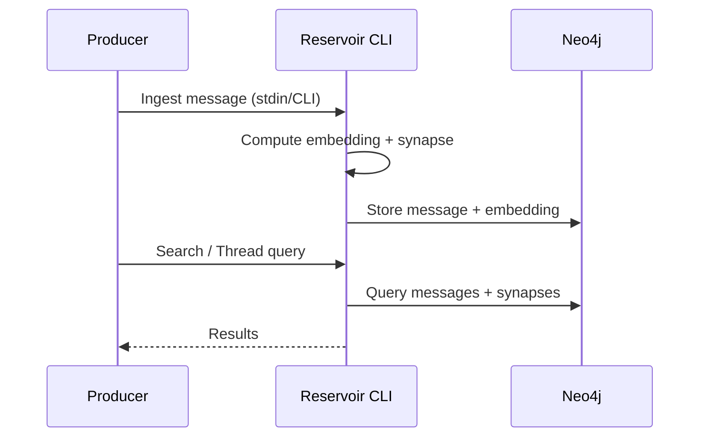

# Reservoir


## Abstract

Reservoir is a CLI-first memory store for conversational messages. It stores messages in a Neo4j graph database, computes embeddings, and links semantically related messages (synapses) to enable search and thread context.


## Problem Statement

Most chat systems are stateless. Each request must include complete conversation history to maintain context, which leads to problems like:

1. Manual conversation state management
2. Token limit constraints as conversations grow
3. Inability to reference semantically related conversations
4. No persistent storage of conversation data

## Solution

Reservoir provides a CLI workflow that:

- Stores all messages in a Neo4j graph database
- Computes embeddings using BGE-Large-EN-v1.5 (current default)
- Creates semantic relationships (synapses) between similar messages
- Enables semantic search and thread context retrieval
- Supports export/import for backups and bulk ingestion

## Architecture



## Data Model

Conversations are stored as a graph structure:
- **MessageNode**: Individual messages with embeddings
- **EmbeddingNode**: Vector representations for semantic search
- **SYNAPSE**: Relationships between semantically similar messages
- **RESPONDED_WITH**: Sequential conversation flow
- **HAS_EMBEDDING**: Message-to-embedding associations

## Semantic Relationships

Reservoir creates synapses between messages when cosine similarity exceeds 0.85. This enables:
- Cross-conversation context injection
- Topic thread identification
- Semantic search capabilities


## Usage

Ingest a message from stdin:
```bash
echo "Hello world" | cargo run -- ingest --partition myapp --instance chat1 --role user --trace-id trace-123
```

Search by keyword:
```bash
cargo run -- search "neo4j" --partition myapp --instance chat1
```

Semantic search:
```bash
cargo run -- search "neo4j configuration" --semantic --partition myapp --instance chat1
```

Thread context (synapse-connected + recent):
```bash
cargo run -- thread --partition myapp --instance chat1 --count 20
```

Export/Import:
```bash
cargo run -- export > messages.json
cargo run -- import messages.json
```

The system organizes conversations using a partition/instance hierarchy for multi-tenant isolation.

## Implementation

Run the CLI:
```bash
cargo run -- --help
```

Reservoir reads Neo4j connection settings from `reservoir.toml` (under your config directory) or environment variables (`NEO4J_URI`, `NEO4J_USER`, `NEO4J_PASSWORD`).

## Documentation

Technical documentation is available at [sectorflabs.com/reservoir](https://sectorflabs.com/reservoir/).

Local documentation can be built with:
```bash
make book
```

## Reference Implementation

A reference talk demonstrating the system architecture:
[](https://youtu.be/oNc2ljo_BwU?si=b9Th_Pt5e6qllI0W)

## License

BSD 3-Clause License
