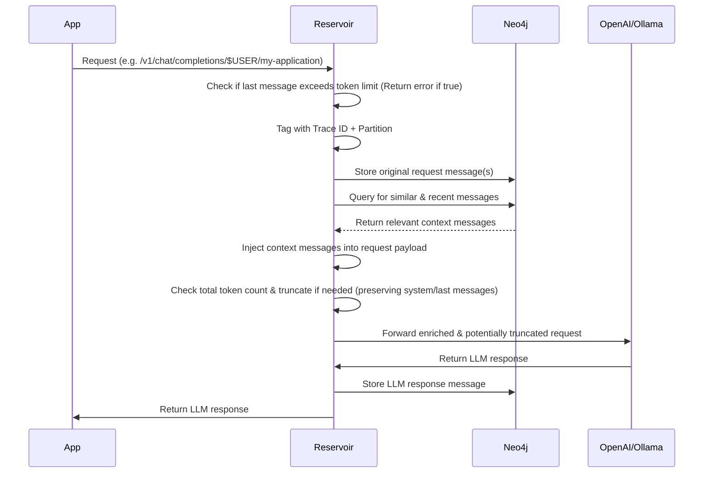
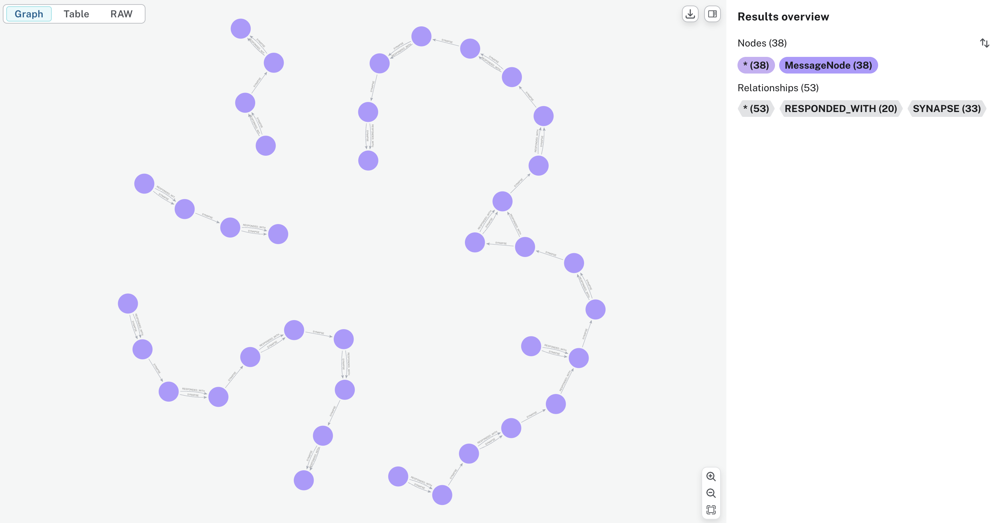

# Reservoir

## What is Reservoir?

Reservoir is essentially memory for AI conversations. It sits between your app and any OpenAI-compatible Chat Completions API, making it easier to have rich, ongoing conversations with your favorite language models from multiple providers.

### Why does this matter?

When you use any [OpenAI-compatible Chat Completions API](https://platform.openai.com/docs/guides/chat), you need to send the full conversation history with every request. For example:

```json
[
  {"role": "user", "content": "What is 1 + 1?"},
  {"role": "assistant", "content": "2"},
  {"role": "user", "content": "What is the answer times 3?"}
]
```

If you only send the last question, the model won't know what "the answer" refers to. You have to keep track of all previous messages and include them every time.

**This can get tricky as conversations grow!**

Reservoir acts as a smart proxy: it automatically stores your chat history and inserts the right context into each request. You just talk to any OpenAI-compatible API as usual and Reservoir handles the memory, context, and even finds other relevant messages from your past conversations to help the model give better answers.

**Supported Providers:**
- OpenAI (GPT-4, GPT-4o, GPT-3.5-turbo, etc.)
- Ollama (llama3.2, gemma3, and any local models)
- Mistral AI (mistral-large-2402, etc.)
- Google Gemini (gemini-2.0-flash, etc.)
- Any OpenAI-compatible API endpoint

**Key Benefits:**
- No more manual history management
- Automatic context enrichment
- Your data stays private and local
- Search and recall previous conversations
- Visualize conversation connections
- Multi-provider support

### Use Reservoir with Multiple Apps

You can point multiple apps or clients to a single Reservoir instance. This means you can keep context and history across different tools on your computer—like your terminal, a web app, or a chat client. If you want to keep conversations separate, you can use Reservoir's partitioning feature to organize chats by app, project, or any context you choose.

### Talks
[](https://youtu.be/oNc2ljo_BwU?si=b9Th_Pt5e6qllI0W)

## Table of Contents

- [Overview](#overview)
- [Conversation Threads via Synapses](#conversation-threads-via-synapses)
- [Documentation](#documentation)
- [Quick Start](#quick-start)
- [License](#license)

## Overview

Reservoir intercepts your API calls, enriches them with relevant history, manages token limits, and then forwards them to the actual LLM service.



This sequence diagram provides a high-level overview of how Reservoir processes requests and responses.

## Conversation Threads via Synapses

Reservoir uses synapse relationships to create "threads" of semantically related messages within the conversation graph. As messages are added, synapses link them sequentially, forming a continuous flow. When the similarity between messages drops below a threshold, the thread is split, marking a topic change. This results in distinct conversation threads, making it easy to visualize and retrieve related exchanges.

You can see an example of this structure in the following graph visualization:



## Documentation

### Complete Documentation

For comprehensive documentation, visit: **[sectorflabs.com/reservoir](http://sectorflabs.com/reservoir/)**

The documentation website includes:
- **Quick Start Guide**: Get up and running in minutes
- **Chat Gipitty Integration**: Add memory to your cgip conversations
- **API Reference**: Complete endpoint documentation
- **Usage Examples**: Python, curl, and integration examples
- **Architecture Deep Dive**: System design and data model
- **Deployment Guides**: Local and production setup
- **Troubleshooting**: Common issues and solutions

### Local Documentation

You can also build and serve the documentation locally:

```bash
# Build documentation to docs/ folder
make book

# Serve locally with live reload
make serve-book
```

### Individual Documentation Files

For quick reference, individual documentation files are also available:

- [Architecture](./docs/architecture.md): System and component overview.
- [API](./docs/api.md): API endpoints, usage, and examples.
- [Data Model](./docs/data_model.md): How data is stored in Neo4j, including the schema.
- [Development](./docs/dev.md): Setting up the development environment, running locally, and contributing.
- [Features](./docs/features.md): Key features and future roadmap.
- [Deployment](./docs/deployment.md): Steps to deploy Reservoir locally or in production.
- [FAQ](./docs/faq.md): Troubleshooting, common questions, and tips.

## Quick Start

To start using Reservoir, visit the [Quick Start Guide](https://sectorflabs.com/reservoir/quick-start.html) in our documentation.

Basic usage:
1. Start the Reservoir server: `cargo run -- start`
2. Replace your OpenAI API endpoint with Reservoir's endpoint
3. Continue using your existing OpenAI-compatible client

**Instead of:**  
`https://api.openai.com/v1/chat/completions`

**Use:**  
`http://127.0.0.1:3017/partition/$USER/instance/reservoir/v1/chat/completions`

For detailed examples, configuration options, and advanced usage, see the [complete documentation](https://sectorflabs.com/reservoir/).

## License

This project is licensed under the BSD 3-Clause License - see the [LICENSE](LICENSE) file for details.
