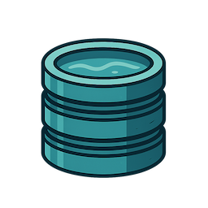
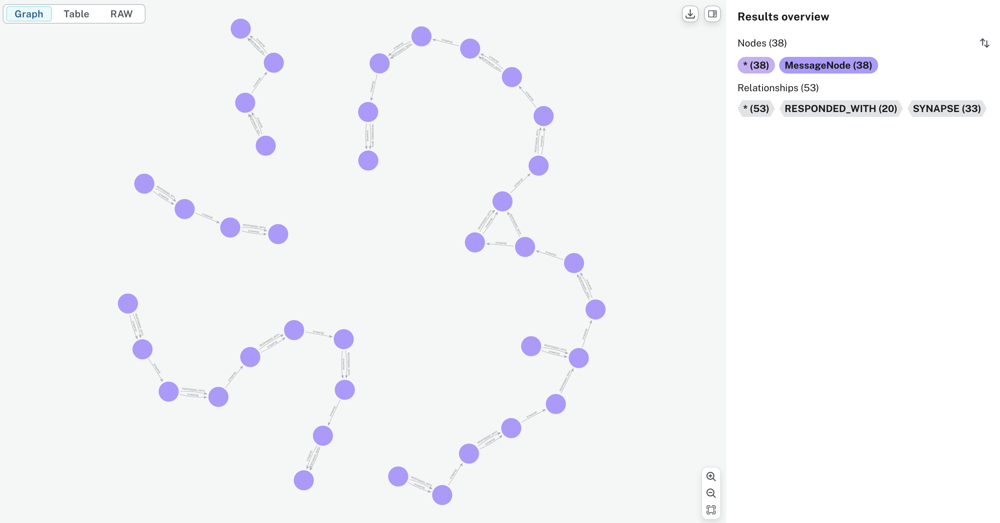

# 🚧 Under Construction

> Reservoir is in active development. It's not ready for production use yet. Expect breaking changes.

# Reservoir

## What is Reservoir?

Reservoir is your helpful memory for AI conversations. It sits between your app and the OpenAI Chat Completions API, making it easier to have rich, ongoing conversations with your favorite language models.

### Why does this matter?

When you use the [OpenAI Chat Completions API](https://platform.openai.com/docs/guides/chat), you need to send the full conversation history with every request. For example:

```json
[
  {"role": "user", "content": "What is 1 + 1?"},
  {"role": "assistant", "content": "2"},
  {"role": "user", "content": "What is the answer times 3?"}
]
```

If you only send the last question, the model won't know what "the answer" refers to. You have to keep track of all previous messages and include them every time.

**This can get tricky as conversations grow!**

Reservoir acts as a smart proxy: it automatically stores your chat history and inserts the right context into each request. You just talk to the API as usual and Reservoir handles the memory, context, and even finds other relevant messages from your past conversations to help the model give better answers.

- No more manual history management
- Automatic context enrichment
- Your data stays private and local

### Use Reservoir with Multiple Apps

You can point multiple apps or clients to a single Reservoir instance. This means you can keep context and history across different tools on your computer—like your terminal, a web app, or a chat client. If you want to keep conversations separate, you can use Reservoir's partitioning feature to organize chats by app, project, or any context you choose.

## Why Use Reservoir?

- **Own your AI history**: All your conversations are stored locally, never in the cloud.
- **Search and recall**: Instantly find previous chats, ideas, or code snippets from your AI interactions.
- **Enrich context**: Automatically inject relevant history into new prompts for more coherent, personalized responses.
- **Visualize conversations**: See how your discussions branch and connect over time.
- **Stay private**: Your data never leaves your device.



Reservoir lets you have conversations with multiple AI models and providers, all while keeping your data private and local. Every interaction is stored on your device, building a personal knowledge base that never leaves your network. A single thread of conversation can span multiple models without losing context, allowing you to seamlessly switch between different AI providers while maintaining the flow of your discussion.

## Table of Contents
- [Overview](#overview)
- [Conversation Threads via Synapses](#conversation-threads-via-synapses)
- [Documentation](#documentation)
- [Quick Start](#quick-start)
- [License](#license)

## Overview
Reservoir intercepts your API calls, enriches them with relevant history, manages token limits, and then forwards them to the actual LLM service.

```mermaid
sequenceDiagram
    participant App
    participant Reservoir
    participant Neo4j
    participant LLM as OpenAI/Ollama

    App->>Reservoir: Request (e.g. /v1/chat/completions/$USER/my-application)
    Reservoir->>Reservoir: Check if last message exceeds token limit (Return error if true)
    Reservoir->>Reservoir: Tag with Trace ID + Partition
    Reservoir->>Neo4j: Store original request message(s)

    %% --- Context Enrichment Steps ---
    Reservoir->>Neo4j: Query for similar & recent messages
    Neo4j-->>Reservoir: Return relevant context messages
    Reservoir->>Reservoir: Inject context messages into request payload
    %% --- End Enrichment Steps ---

    Reservoir->>Reservoir: Check total token count & truncate if needed (preserving system/last messages)

    Reservoir->>LLM: Forward enriched & potentially truncated request
    LLM->>Reservoir: Return LLM response
    Reservoir->>Neo4j: Store LLM response message
    Reservoir->>App: Return LLM response
```

This sequence diagram provides a high-level overview of how Reservoir processes requests and responses.


## Conversation Threads via Synapses

Reservoir uses synapse relationships to create "threads" of semantically related messages within the conversation graph. As messages are added, synapses link them sequentially, forming a continuous flow. When the similarity between messages drops below a threshold, the thread is split, marking a topic change. This results in distinct conversation threads, making it easy to visualize and retrieve related exchanges.

You can see an example of this structure in the following graph visualization:



## Documentation

Reservoir's documentation is organized into the following sections:
- [Architecture](./docs/architecture.md): System and component overview.
- [API](./docs/api.md): API endpoints, usage, and examples.
- [Data Model](./docs/data_model.md): How data is stored in Neo4j, including the schema.
- [Development](./docs/dev.md): Setting up the development environment, running locally, and contributing.
- [Features](./docs/features.md): Key features and future roadmap.
- [Deployment](./docs/deployment.md): Steps to deploy Reservoir locally or in production.
- [FAQ](./docs/faq.md): Troubleshooting, common questions, and tips.

## Quick Start

Reservoir provides an OpenAI-compatible API endpoint. You can use your system username as the partition and your application name as the instance for best results.

### Starting the Server

To start the Reservoir server:

```bash
cargo run -- start
```

This command:
1. Initializes the vector index in Neo4j for semantic search
2. Starts the server on the configured port (default: 3017)

The server will be available at `http://localhost:3017` (or your configured port).

### Import/Export Data

Reservoir supports exporting all message nodes to a JSON file and importing them back into the database. This is useful for backup, migration, or sharing your AI conversation history.

#### Export all message nodes to JSON

```bash
cargo run -- export > messages.json
```
This command prints all message nodes in the database as pretty-printed JSON to stdout. Redirect the output to a file to save it.

#### Import message nodes from a JSON file

```bash
cargo run -- import path/to/messages.json
```

### View the last N messages

```bash
cargo run -- view <COUNT> [--partition <PARTITION>] [--instance <INSTANCE>]
```

Displays the last `<COUNT>` messages in the specified partition and instance. If not provided, `partition` defaults to "default" and `instance` defaults to the partition.

Example:
```bash
cargo run -- view 5 --partition sales --instance eu-west
```

Sample output:
```
2025-05-09T14:23:01+00:00 [abc123] user: Hello there!
2025-05-09T14:23:02+00:00 [abc123] assistant: Hi! How can I help?
2025-05-09T14:24:10+00:00 [def456] user: Show me last week's sales report.
2025-05-09T14:24:12+00:00 [def456] assistant: Here is the summary for last week's sales...
2025-05-09T14:25:00+00:00 [ghi789] user: Thanks!
```
This command reads the specified JSON file (in the same format as the export) and imports all message nodes into the database.

### Example Usage
- **Instead of**:
  https://api.openai.com/v1/chat/completions
- **Use**:
  http://localhost:3017/v1/partition/$USER/instance/my-application/chat/completions

Here, `$USER` is the system username, and `my-application` is the instance. Context enrichment and history retrieval are scoped to the specific `partition`/`instance` combination.

#### Curl Example
```bash
curl http://localhost:3017/v1/partition/$USER/instance/my-application/chat/completions \
    -H "Content-Type: application/json" \
    -H "Authorization: Bearer $OPENAI_API_KEY" \
    -d '{
        "model": "gpt-4",
        "messages": [
            {
                "role": "user",
                "content": "Write a one-sentence bedtime story about a brave little toaster."
            }
        ]
    }'
```

#### Python Example (using `openai` library)
```python
import os
from openai import OpenAI

INSTANCE = "my-application"
PARTITION = os.getenv("USER")
RESERVOIR_PORT = os.getenv('RESERVOIR_PORT', '3017')
RESERVOIR_BASE_URL = f"http://localhost:{RESERVOIR_PORT}/v1/partition/{PARTITION}/instance/{INSTANCE}"

client = OpenAI(
    base_url=RESERVOIR_BASE_URL,
    api_key=os.environ.get("OPENAI_API_KEY")
)

completion = client.chat.completions.create(
    model="gpt-4",
    messages=[
        {
            "role": "user",
            "content": "Write a one-sentence bedtime story about a curious robot."
        }
    ]
)
print(completion.choices[0].message.content)
```

## License

This project is licensed under the Apache License 2.0 - see the [LICENSE](LICENSE) file for details.

