# Context Enrichment

Context enrichment is Reservoir's core mechanism for providing intelligent, memory-aware LLM conversations. By automatically injecting relevant historical context and recent conversation history into each request, Reservoir gives LLM models a persistent memory that improves response quality and maintains conversational continuity across sessions.

## Overview

When you send a message to Reservoir, the system automatically enhances your request with:
- **Semantically similar messages** from past conversations (using vector similarity search)
- **Recent conversation history** from the same partition/instance
- **Connected conversation threads** through synapse relationships

This enriched context is injected into your request before forwarding it to the LLM provider, making the LLM aware of relevant past discussions.

## Context Enrichment Process

### 1. Message Reception and Initial Processing

```rs
pub async fn handle_with_partition(
    partition: &str,
    instance: &str,
    whole_body: Bytes,
) -> Result<Bytes, Error> {
    let json_string = String::from_utf8_lossy(&whole_body).to_string();
    let chat_request_model = ChatRequest::from_json(json_string.as_str()).expect("Valid JSON");
    let model_info = ModelInfo::new(chat_request_model.model.clone());

    let trace_id = Uuid::new_v4().to_string();
    let service = ChatRequestService::new();
```

When a request arrives:
- A unique **trace ID** is generated for tracking
- The request is parsed and validated
- Model information is extracted to determine token limits

### 2. Embedding Generation

```rs
    let search_term = last_message.content.as_str();
    get_last_message_in_chat_request(&chat_request_model)?;

    info!("Using search term: {}", search_term);
    let embedding_info = EmbeddingInfo::with_fastembed("bge-large-en-v15");
    let embeddings = get_embeddings_for_txt(search_term, embedding_info.clone()).await?;

    let context_size = config::get_context_size();
```

The last user message is used as the search term to generate vector embeddings using the BGE-Large-EN-v1.5 model. This embedding represents the semantic meaning of the current query.

### 3. Semantic Context Retrieval

```rs
    let similar = get_related_messages_with_strategy(
        embeddings,
        &embedding_info,
        partition,
        instance,
        context_size,
    )
    .await?;
```

Using the generated embedding, Reservoir searches for semantically similar messages from past conversations within the same partition/instance. The search strategy includes:

#### Vector Similarity Search
```rs
    let query_string = format!(
        r#"
                CALL db.index.vector.queryNodes(
                    '{}',
                    $topKExtended,
                    $embedding
                ) YIELD node, score
                WITH node, score
                WHERE node.partition = $partition
                  AND node.instance = $instance
                RETURN node.partition AS partition,
                       node.instance AS instance,
                       node.embedding AS embedding,
                       node.model AS model,
                       id(node) AS id,
                       score
                ORDER BY score DESC
                "#,
        embedding_info.get_index_name()
    );
```

#### Synapse Expansion
```rs
pub async fn get_related_messages_with_strategy(
    embedding: Vec<f32>,
    embedding_info: &EmbeddingInfo,
    partition: &str,
    instance: &str,
    top_k: usize,
) -> Result<Vec<MessageNode>, Error> {
    let similar_messages =
        get_most_similar_messages(embedding, embedding_info, partition, instance, top_k).await?;
    let mut found_messages = vec![];
    for message in similar_messages.clone() {
        let mut connected = get_nodes_connected_by_synapses(connect, &message).await?;
        if found_messages.len() > top_k * 3 {
            break;
        }
        if connected.len() > 2 {
            found_messages.append(connected.as_mut());
        }
        found_messages = deduplicate_message_nodes(found_messages);
    }

    Ok(found_messages.into_iter().take(top_k).collect())
}
```

The system expands the context by following synapse relationships - connections between messages that are semantically similar (cosine similarity > 0.85).

### 4. Recent History Retrieval

```rs
    let last_messages = get_last_messages_for_partition_and_instance(
        connect,
        partition.to_string(),
        instance.to_string(),
        LAST_MESSAGES_LIMIT,
    )
    .await
    .unwrap_or_else(|e| {
        error!("Error finding last messages: {}", e);
        Vec::new()
    });
```

Retrieves the most recent 15 messages from the same partition/instance to provide immediate conversational context.

### 5. Context Injection

```rs
let mut enriched_chat_request =
        enrich_chat_request(similar, last_messages, &chat_request_model);
truncate_messages_if_needed(&mut enriched_chat_request.messages, model_info.input_tokens);
```

The `enrich_chat_request` function combines all context sources:

```rs
pub fn enrich_chat_request(
    similar_messages: Vec<MessageNode>,
    mut last_messages: Vec<MessageNode>, // Add `mut` here
    chat_request: &ChatRequest,
) -> ChatRequest {
    let mut chat_request = chat_request.clone();

    let semantic_prompt = r#"The following is the result of a semantic search 
        of the most related messages by cosine similarity to previous 
        conversations"#;
    let recent_prompt = r#"The following are the most recent messages in the 
        conversation in chronological order"#;

    last_messages.sort_by(|a, b| a.timestamp.cmp(&b.timestamp));

    let mut enrichment_block = Vec::new();

    enrichment_block.push(Message {
        role: "system".to_string(),
        content: semantic_prompt.to_string(),
    });
    enrichment_block.extend(similar_messages.iter().map(MessageNode::to_message));
    enrichment_block.push(Message {
        role: "system".to_string(),
        content: recent_prompt.to_string(),
    });
    enrichment_block.extend(last_messages.iter().map(MessageNode::to_message));

    enrichment_block.retain(|m| !m.content.is_empty());

    let insert_index = if chat_request
        .messages
        .first()
        .is_some_and(|m| m.role == "system")
    {
        1
    } else {
        0
    };

    // Insert enrichment block
    chat_request
        .messages
        .splice(insert_index..insert_index, enrichment_block);
    chat_request
}
```

The enrichment process:
1. Creates descriptive system prompts to explain the context
2. Adds semantically similar messages with explanation
3. Adds recent chronological history with explanation
4. Inserts the enrichment block after any existing system message
5. Filters out empty messages

### 6. Token Management and Truncation

```rs
truncate_messages_if_needed(&mut enriched_chat_request.messages, model_info.input_tokens);
```

The enriched request may exceed the model's token limits. The truncation algorithm:

```rs
pub fn truncate_messages_if_needed(messages: &mut Vec<Message>, limit: usize) {
    let mut current_tokens = count_chat_tokens(messages);
    info!("Current token count: {}", current_tokens);

    if current_tokens <= limit {
        return; // No truncation needed
    }

    info!(
        "Token count ({}) exceeds limit ({}), truncating...",
        current_tokens, limit
    );

    // Identify indices of system messages and the last message
    let system_message_indices: HashSet<usize> = messages
        .iter()
        .enumerate()
        .filter(|(_, m)| m.role == "system")
        .map(|(i, _)| i)
        .collect();
    let last_message_index = messages.len().saturating_sub(1); // Index of the last message

    // Start checking for removal from the first message
    let mut current_index = 0;

    while current_tokens > limit && current_index < messages.len() {
        // Check if the current index is a system message or the last message
        if system_message_indices.contains(&current_index) || current_index == last_message_index {
            // Skip this message, move to the next index
            current_index += 1;
            continue;
        }

        // If it's safe to remove (not system, not the last message)
        if messages.len() > 1 {
            // Ensure we don't remove the only message left (shouldn't happen here)
            info!(
                "Removing message at index {}: Role='{}', Content='{}...'",
                current_index,
                messages[current_index].role,
                messages[current_index]
                    .content
                    .chars()
                    .take(30)
                    .collect::<String>()
            );
            messages.remove(current_index);
            // Don't increment current_index, as removing shifts subsequent elements down.
            // Recalculate tokens and update system/last indices if needed (though less efficient)
            // For simplicity here, we just recalculate tokens. A more optimized approach
            // might update indices, but given the context size, recalculating tokens is okay.
            current_tokens = count_chat_tokens(messages);
            // Re-evaluate system_message_indices and last_message_index is safer if indices change significantly,
            // but let's stick to the simpler approach for now. If performance becomes an issue, optimize this.
        } else {
            // Safety break: Should not be able to remove the last message due to the check above.
            error!("Warning: Truncation stopped unexpectedly.");
            break;
        }
    }

    info!("Truncated token count: {}", current_tokens);
}
```

The truncation algorithm preserves:
- All system messages (including enrichment context)
- The user's current/last message
- Removes older context messages if needed

### 7. Response Storage and Synapse Building

After receiving the LLM's response:

```rs
let message_node = chat_response.choices.first().unwrap().message.clone();
let embedding =
    get_embeddings_for_txt(message_node.content.as_str(), embedding_info.clone()).await?;
let message_node = MessageNode::from_message(
    &message_node,
    trace_id.as_str(),
    partition,
    instance,
    embedding,
);
save_message_node(connect, &message_node, &embedding_info)
    .await
    .expect("Failed to save message node");

connect_synapses(connect)
    .await
    .expect("Failed to connect synapses");
```

1. The LLM's response is stored with its own embedding
2. Synapses (semantic connections) are built between messages
3. The system continuously builds a knowledge graph of related conversations

## Context Architecture Flow

```mermaid
flowchart TD
    A["User Request Arrives"] --> B["Generate Trace ID & Parse Request"]
    B --> C["Extract Last User Message"]
    C --> D["Generate Embedding<br/>(BGE-Large-EN-v1.5)"]
    
    %% Parallel context retrieval
    D --> E["Semantic Search"]
    D --> F["Recent History Query"]
    
    E --> E1["Vector Similarity Search<br/>(Neo4j Index)"]
    E1 --> E2["Expand via Synapses<br/>(Related Conversations)"]
    E2 --> E3["Deduplicate Messages"]
    
    F --> F1["Get Last 15 Messages<br/>(Same Partition/Instance)"]
    F1 --> F2["Sort by Timestamp"]
    
    %% Context assembly
    E3 --> G["Assemble Context Block"]
    F2 --> G
    
    G --> G1["Add Semantic Context<br/>'The following is semantic search...'"]
    G1 --> G2["Add Similar Messages"]
    G2 --> G3["Add Recent Context<br/>'The following are recent messages...'"]
    G3 --> G4["Add Recent Messages"]
    
    %% Context injection
    G4 --> H["Inject Context into Request"]
    H --> H1{"Check if System Message Exists"}
    H1 -->|Yes| H2["Insert after System Message"]
    H1 -->|No| H3["Insert at Beginning"]
    
    H2 --> I["Token Management"]
    H3 --> I
    
    %% Token management
    I --> I1["Count Total Tokens"]
    I1 --> I2{"Exceeds Token Limit?"}
    I2 -->|No| J["Send to AI Provider"]
    I2 -->|Yes| I3["Smart Truncation"]
    
    I3 --> I4["Preserve System Messages"]
    I4 --> I5["Preserve Last User Message"]
    I5 --> I6["Remove Older Context"]
    I6 --> I7["Recalculate Tokens"]
    I7 --> I2
    
    %% AI interaction
    J --> K["AI Provider Response"]
    K --> L["Store Response"]
    
    %% Post-processing
    L --> L1["Generate Response Embedding"]
    L1 --> L2["Save to Neo4j with Trace ID"]
    L2 --> L3["Link User-Assistant Messages"]
    L3 --> M["Build Synapses"]
    
    M --> M1["Calculate Similarity Scores<br/>(Cosine Similarity)"]
    M1 --> M2["Create SYNAPSE Relationships<br/>(Score > 0.85)"]
    M2 --> M3["Remove Weak Synapses<br/>(Score < 0.85)"]
    
    M3 --> N["Return Enriched Response"]
    
    %% Styling
    classDef inputStep fill:#e1f5fe
    classDef processStep fill:#f3e5f5
    classDef storageStep fill:#e8f5e8
    classDef aiStep fill:#fff3e0
    classDef outputStep fill:#fce4ec
    
    class A,C inputStep
    class B,D,E,E1,E2,E3,F,F1,F2,G,G1,G2,G3,G4,H,H1,H2,H3,I,I1,I2,I3,I4,I5,I6,I7 processStep
    class L,L1,L2,L3,M,M1,M2,M3 storageStep
    class J,K aiStep
    class N outputStep
```



## Key Configuration Parameters

### Context Size
```rs
pub fn get_context_size() -> usize {
    get_config().semantic_context_size.unwrap_or(15)
}
```

The semantic context size (default: 15) determines how many semantically similar messages are retrieved and potentially included in the context.

### Recent Messages Limit
```rs
const LAST_MESSAGES_LIMIT: usize = 15;
```

The system retrieves up to 15 most recent messages from the same partition/instance for chronological context.

### Embedding Model
```rs
let embedding_info = EmbeddingInfo::with_fastembed("bge-large-en-v15");
```

Reservoir by default uses a local instace of BGE-Large-EN-v1.5 for generating embeddings, for providing high-quality semantic representations.

### Synapse Threshold
```cypher
MATCH (m1:MessageNode)-[r:SYNAPSE]->(m2:MessageNode)
WHERE r.score < 0.85
DELETE r
```

Only relationships with cosine similarity scores above 0.85 are maintained as synapses, ensuring high-quality semantic connections.

## Key Concepts

### Partitions and Instances
Context is scoped to specific partition/instance combinations, allowing for:
- **Organizational separation**: Different teams or projects can have isolated contexts
- **Application isolation**: Multiple applications can use the same Reservoir instance without cross-contamination
- **User-specific contexts**: Individual users can maintain separate conversation histories

### Synapses
Synapses are semantic relationships between messages that:
- **Connect related conversations** across different sessions
- **Build over time** as the system learns from interactions  
- **Self-organize** the knowledge graph based on content similarity
- **Get pruned automatically** when relationships are too weak (< 0.85 similarity)

### Trace IDs
Every request gets a unique trace ID that:
- **Links user messages to LLM responses** within the same conversation turn
- **Enables conversation threading** and relationship building
- **Provides audit trails** for debugging and analysis
- **Supports parallel processing** of multiple simultaneous requests

### System Context Compression
```rs
pub fn compress_system_context(messages: &[Message]) -> Vec<Message> {
    let first_index = messages.iter().position(|m| m.role == "system");
    let last_index = messages.iter().rposition(|m| m.role == "system");

    if let (Some(first), Some(last)) = (first_index, last_index) {
        if first != 0 || first == last {
            return messages.to_vec();
        }

        let mut compressed = vec![messages[0].clone()];

        for item in messages.iter().take(last + 1).skip(first + 1) {
            compressed[0].content += &format!("\n{}", message_to_string(item));
        }

        compressed.extend_from_slice(&messages[last + 1..]);
        compressed
    } else {
        messages.to_vec()
    }
}
```

Multiple system messages (including enrichment context) are compressed into a single system message to optimize token usage while preserving all contextual information.

## Benefits of Context Enrichment

1. **Conversational Continuity**: LLM maintains awareness of past discussions across sessions
2. **Semantic Understanding**: Related topics are automatically surfaced even when not explicitly mentioned
3. **Multi-Session Learning**: Knowledge accumulates over time, improving response quality
4. **Cross-Model Memory**: Context persists when switching between different LLM providers
5. **Intelligent Prioritization**: Most relevant historical context is prioritized while respecting token limits
6. **Automatic Organization**: The system builds its own knowledge graph without manual intervention

## Performance Considerations

- **Vector Indexing**: Neo4j's vector indices provide sub-second similarity search even with large conversation histories
- **Parallel Processing**: Semantic search and recent history retrieval happen concurrently
- **Smart Truncation**: Context is intelligently trimmed to fit model limits while preserving essential information
- **Synapse Pruning**: Weak connections are automatically removed to maintain graph quality
- **Token Optimization**: System messages are compressed to maximize available context within token limits
