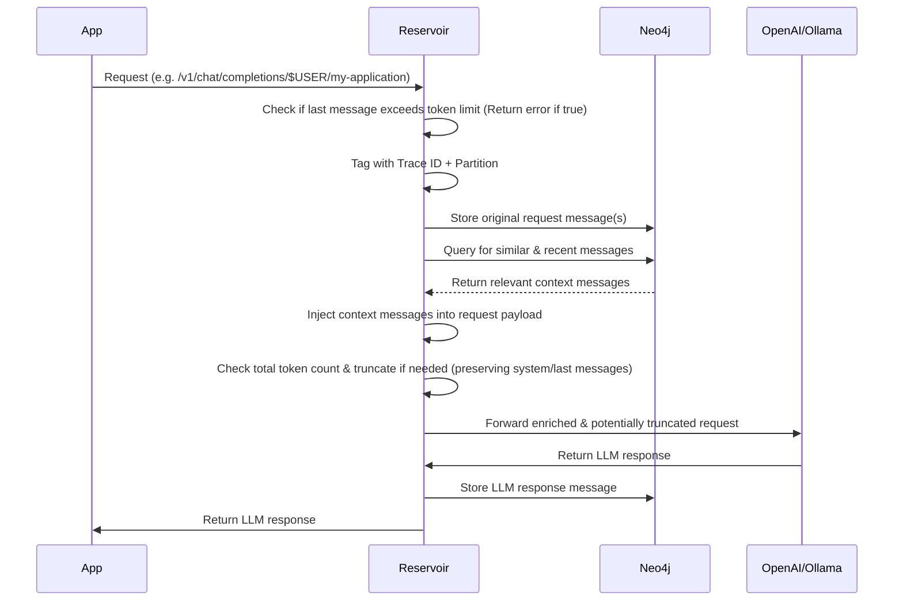
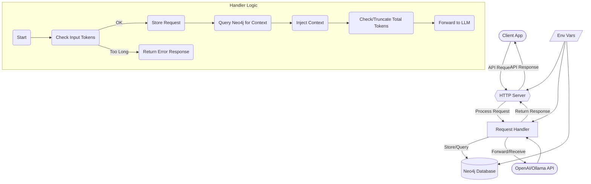

# System Architecture

Reservoir is designed as a transparent proxy for OpenAI-compatible APIs, with a focus on capturing and enriching AI conversations. This section provides an overview of the system architecture and how components interact.

## Request Processing Sequence

Reservoir intercepts your API calls, enriches them with relevant history, manages token limits, and then forwards them to the actual LLM service. Here's the detailed sequence:

## High-Level Architecture

## Core Components

### 1. Client Application
Your application making API calls to Reservoir. This could be:
- A web application using the OpenAI JavaScript library
- A Python script using the OpenAI Python library
- A command-line tool like curl
- Any application that can make HTTP requests

### 2. HTTP Server (Hyper/Tokio)
The HTTP server built on Rust's async ecosystem:
- **Receives requests** on the configured port (default: 3017)
- **Routes based on URL path** following the pattern `/v1/partition/{partition}/instance/{instance}/chat/completions`
- **Handles CORS** for web applications
- **Manages concurrent requests** efficiently using Tokio's async runtime

### 3. Request Handler
The core logic that processes each request:

#### Input Validation
- **Token size checking**: Validates that the last message doesn't exceed token limits
- **Request format validation**: Ensures the request follows OpenAI's API structure
- **Authentication**: Forwards API keys to the appropriate provider

#### Context Management
- **Trace ID assignment**: Each request gets a unique identifier for tracking
- **Partition/Instance extraction**: Pulls organization parameters from the URL path
- **Message storage**: Stores incoming messages in Neo4j with proper tagging

#### Context Enrichment
- **Historical context query**: Searches Neo4j for relevant past conversations
- **Similarity matching**: Uses vector embeddings to find semantically similar messages
- **Recency filtering**: Includes recent messages from the same partition/instance
- **Context injection**: Adds relevant context to the request payload

#### Token Management
- **Total token calculation**: Counts tokens in the enriched message list
- **Smart truncation**: Removes older context while preserving system prompts and latest messages
- **Provider-specific limits**: Respects different token limits for different models

#### Request Forwarding
- **Provider routing**: Automatically routes to the correct provider based on model name
- **Request forwarding**: Sends the enriched request to the upstream LLM
- **Response handling**: Processes and stores the LLM's response

#### Relationship Building
- **Synapse connections**: Links semantically similar messages using vector similarity
- **Weak connection removal**: Removes relationships with similarity scores below 0.85
- **Conversation threading**: Maintains coherent conversation threads over time

### 4. Neo4j Database
The graph database that stores all conversation data:

#### Data Storage
- **MessageNode entities**: Each message is stored as a node with properties
- **Partition/Instance tagging**: Messages are tagged for proper organization
- **Vector embeddings**: Semantic representations for similarity search
- **Temporal information**: Timestamps for recency-based queries

#### Graph Relationships
- **Synapse relationships**: Connect related messages across conversations
- **Conversation threads**: Maintain sequential flow of discussions
- **Similarity scores**: Weighted relationships based on semantic similarity

#### Query Capabilities
- **Vector similarity search**: Find semantically similar messages
- **Temporal queries**: Retrieve recent messages within time windows
- **Graph traversal**: Navigate conversation relationships
- **Partition/Instance filtering**: Scope queries to specific contexts

### 5. External LLM Services
Reservoir supports multiple AI providers:
- **OpenAI**: GPT-4, GPT-4o, GPT-3.5-turbo, and specialized models
- **Ollama**: Local models like Llama, Gemma, and custom models
- **Mistral AI**: Mistral's cloud-hosted models
- **Google Gemini**: Google's AI models
- **Custom providers**: Any OpenAI-compatible API endpoint

### 6. Configuration Management
Environment-based configuration:
- **Database connection**: Neo4j URI, credentials, and connection pooling
- **Server settings**: Port, host, CORS configuration
- **API keys**: Credentials for various AI providers
- **Provider endpoints**: Custom URLs for different services
- **Token limits**: Configurable limits for different models

## Request Processing Flow

1. **Request Arrival**: Client sends a request to Reservoir's endpoint
2. **URL Parsing**: Extract partition and instance from the URL path
3. **Input Validation**: Check message format and token limits
4. **Message Storage**: Store the user's message in Neo4j
5. **Context Retrieval**: Query for relevant historical context
6. **Context Enrichment**: Inject relevant messages into the request
7. **Token Management**: Ensure the enriched request fits within limits
8. **Provider Routing**: Determine which AI provider to use
9. **Request Forwarding**: Send the enriched request to the AI provider
10. **Response Processing**: Receive and process the AI's response
11. **Response Storage**: Store the AI's response in Neo4j
12. **Relationship Building**: Create or update message relationships
13. **Response Return**: Send the response back to the client

## Scalability Considerations

### Horizontal Scaling
- **Stateless design**: Each request is independent
- **Database connection pooling**: Efficient resource utilization
- **Async processing**: Non-blocking I/O for high concurrency

### Vertical Scaling
- **Memory management**: Efficient vector storage and retrieval
- **CPU optimization**: Fast similarity calculations
- **Disk I/O**: Optimized database queries and indexing

### Performance Optimizations
- **Vector indexing**: Fast similarity search in Neo4j
- **Connection pooling**: Reuse database connections
- **Caching strategies**: Cache frequently accessed data
- **Batching**: Efficient bulk operations where possible

## Security Architecture

### Authentication
- **API key forwarding**: Secure handling of provider credentials
- **No key storage**: Reservoir doesn't store AI provider keys
- **Environment-based secrets**: Secure configuration management

### Data Privacy
- **Local storage**: All conversation data stays on your infrastructure
- **No external logging**: Conversation content never leaves your network
- **Configurable retention**: Control how long data is stored

### Access Control
- **Partition isolation**: Conversations are isolated by partition/instance
- **URL-based permissions**: Access control through URL structure
- **Network security**: Configurable CORS and network policies

## Monitoring and Observability

### Logging
- **Request tracing**: Unique trace IDs for each request
- **Error logging**: Detailed error information for debugging
- **Performance metrics**: Request timing and processing statistics

### Health Checks
- **Database connectivity**: Monitor Neo4j connection health
- **Provider availability**: Check AI service availability
- **Resource utilization**: Memory and CPU monitoring

This architecture provides a robust, scalable foundation for AI conversation management while maintaining transparency and compatibility with existing applications.