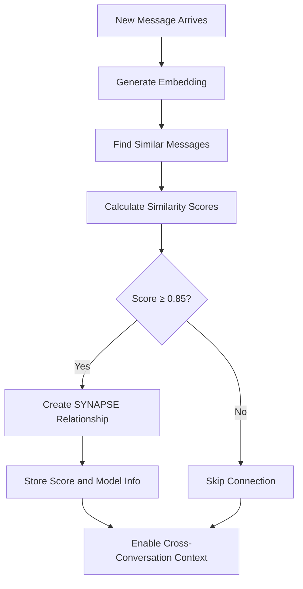

# Conversation Threads (Synapses)

Synapses are Reservoir's intelligent connection system that links semantically related messages across different conversations. Unlike traditional conversation threads that follow chronological order, synapses create a web of connections based on semantic similarity, enabling cross-conversation context discovery and knowledge building.

## What are Synapses?

Synapses are bidirectional relationships between MessageNodes that represent semantic similarity. They enable Reservoir to:

- **Connect related discussions** across different conversations
- **Build knowledge networks** from accumulated conversations
- **Enable context jumping** between related topics
- **Create conversational memory** that spans sessions

## How Synapses Work

### Similarity Calculation

Synapses are created based on vector similarity between message embeddings:

1. **Embedding Generation**: Each message is converted to a vector using BGE-Large-EN-v1.5
2. **Similarity Scoring**: Cosine similarity is calculated between message vectors
3. **Threshold Filtering**: Only connections with similarity ≥ 0.85 become synapses
4. **Bidirectional Links**: Synapses work in both directions (A ↔ B)

### Synapse Creation Process



### Sequential vs. Semantic Synapses

**Sequential Synapses**: Connect consecutive messages in the same conversation
```cypher
// Messages in same conversation thread
(msg1)-[:SYNAPSE {score: 0.95, model: "embedding1536"}]-(msg2)
```

**Semantic Synapses**: Connect similar messages from different conversations
```cypher
// Messages from different conversations with similar content
(msg_python_q1)-[:SYNAPSE {score: 0.88, model: "embedding1536"}]-(msg_python_q2)
```

## Synapse Properties

### Score

Represents the semantic similarity strength between two messages:

- **Range**: 0.0 to 1.0 (higher is more similar)
- **Threshold**: Minimum 0.85 for synapse creation
- **Calculation**: Cosine similarity between embedding vectors
- **Update**: Can be recalculated as models improve

### Model

Indicates which embedding model was used for similarity calculation:

- **Current Default**: "embedding1536" (BGE-Large-EN-v1.5)
- **Purpose**: Enables model-specific synapse management
- **Future-Proofing**: Supports multiple embedding models

### Example Synapse Relationship

```cypher
(message1:MessageNode)-[:SYNAPSE {
    score: 0.92,
    model: "embedding1536"
}]-(message2:MessageNode)
```

## Synapse Network Examples

### Programming Discussion Network

```
"How do I handle errors in Python?"
    ↓ SYNAPSE (0.91)
"What's the best way to catch exceptions?"
    ↓ SYNAPSE (0.87)
"Try/except blocks best practices"
    ↓ SYNAPSE (0.89)
"Error handling in async functions"
```

### Cross-Topic Connections

```
"Database optimization techniques"
    ↓ SYNAPSE (0.86)
"Slow query performance issues"
    ↓ SYNAPSE (0.88)
"Index design for better performance"
```

## Synapse Management

### Automatic Creation

Synapses are created automatically during conversation processing:

```rs
// Simplified creation logic
if similarity_score >= 0.85 {
    create_synapse(message1, message2, similarity_score, "embedding1536");
}
```

### Pruning Low-Quality Synapses

Weak connections are automatically removed to maintain network quality:

```cypher
// Remove synapses below threshold
MATCH (m1:MessageNode)-[r:SYNAPSE]->(m2:MessageNode)
WHERE r.score < 0.85
DELETE r
```

### Synapse Evolution

Synapses can be updated as the system learns:

1. **Score Updates**: Recalculate similarity with improved models
2. **Model Migration**: Update synapses when switching embedding models
3. **Network Optimization**: Remove redundant or weak connections

## Using Synapses for Context

### RAG Strategy with Synapses

When using `--link` search strategy, Reservoir leverages synapses:

```bash
# Use synapse network for enhanced search
reservoir search --link --semantic "error handling"
```

**Process:**
1. Find semantically similar messages
2. Follow SYNAPSE relationships to connected messages
3. Explore conversation threads via synapse networks
4. Deduplicate and rank results
5. Return most relevant connected discussions

### Context Enrichment

Synapses enable intelligent context building:

```cypher
// Context enrichment query using synapses
MATCH (query_msg:MessageNode)-[:SYNAPSE*1..3]-(related:MessageNode)
WHERE query_msg.content CONTAINS "database"
  AND related.partition = $partition
  AND related.instance = $instance
RETURN related
ORDER BY related.timestamp DESC
LIMIT 10
```

## Synapse Network Analysis

### Finding Conversation Hubs

Identify messages that are highly connected (conversation hubs):

```bash
# CLI command to export and analyze
reservoir export | jq -r '.[].content' > messages.txt

# Or via Neo4j query
MATCH (m:MessageNode)-[s:SYNAPSE]-(related:MessageNode)
WITH m, count(s) as connectionCount, avg(s.score) as avgScore
WHERE connectionCount > 5
RETURN m.content, connectionCount, avgScore
ORDER BY connectionCount DESC
```

### Topic Clustering

Synapses naturally create topic clusters:

```
Cluster 1: Web Development
├── "React component best practices" (8 connections)
├── "JavaScript async patterns" (6 connections)
└── "CSS flexbox layouts" (4 connections)

Cluster 2: Database Design
├── "SQL query optimization" (7 connections)
├── "Database normalization" (5 connections)
└── "Index strategy for performance" (3 connections)
```

## Performance Considerations

### Synapse Creation Overhead

- **Computation**: Vector similarity calculation for each new message
- **Storage**: Additional relationships in Neo4j graph
- **Indexing**: Maintenance of vector indices

### Optimization Strategies

1. **Batch Processing**: Create synapses in batches during low-usage periods
2. **Threshold Tuning**: Adjust similarity threshold based on use case
3. **Network Pruning**: Regular cleanup of weak or obsolete synapses
4. **Model Efficiency**: Balance embedding quality vs. computation cost

## Advanced Synapse Features

### Multi-Hop Connections

Synapses enable multi-hop context discovery:

```cypher
// Find messages connected within 3 hops
MATCH path=(start:MessageNode)-[:SYNAPSE*1..3]-(end:MessageNode)
WHERE start.content CONTAINS "machine learning"
RETURN path, length(path)
ORDER BY length(path)
```

### Conversation Path Finding

Discover how topics connect across conversations:

```cypher
// Find shortest path between two topics
MATCH path=shortestPath(
    (topic1:MessageNode {content: "Python async"})-[:SYNAPSE*]-(topic2:MessageNode {content: "Error handling"})
)
RETURN path
```

### Synapse-Based Recommendations

Use synapse networks to suggest related topics:

```bash
# Find related discussions
reservoir search --link --semantic "current topic"

# Or get synapse-connected messages directly
echo "What related topics should I explore?" | reservoir ingest
# Context will include synapse-connected discussions
```

## Troubleshooting Synapses

### Common Issues

1. **Too Many Synapses**: Lower the similarity threshold
2. **Too Few Synapses**: Check embedding quality and threshold
3. **Irrelevant Connections**: Review similarity calculation method
4. **Performance Issues**: Implement batch processing

### Diagnostic Commands

```bash
# View synapse statistics
reservoir export | jq '[.[] | select(.role=="user")] | length'

# Check similarity scores distribution
# (Requires Neo4j query access)
```

### Synapse Replay

Rebuild synapse network when needed:

```bash
# Replay embeddings and rebuild synapses
reservoir replay

# This will:
# 1. Recalculate embeddings for all messages
# 2. Rebuild synapse relationships
# 3. Update similarity scores
# 4. Prune weak connections
```

## Future Enhancements

### Planned Features

1. **Weighted Synapses**: Consider recency and conversation importance
2. **Topic-Aware Synapses**: Enhanced similarity based on topic detection
3. **Hierarchical Synapses**: Multi-level relationship strengths
4. **Synapse Analytics**: Dashboard for network visualization

### Customization Options

1. **Custom Similarity Functions**: Beyond cosine similarity
2. **Domain-Specific Models**: Specialized embeddings for specific fields
3. **User-Defined Thresholds**: Per-partition similarity thresholds
4. **Manual Synapse Management**: User-controlled connection creation

Synapses transform Reservoir from a simple conversation store into an intelligent knowledge network that grows more valuable with each interaction, creating a personalized LLM assistant with genuine conversational memory.
