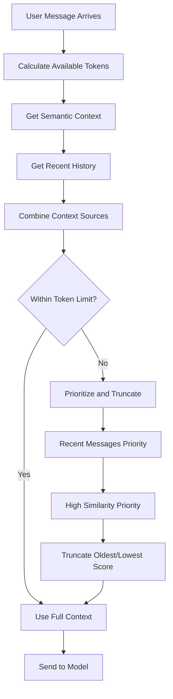

# Token Management

Reservoir intelligently manages token limits to ensure optimal context enrichment while staying within model constraints. The system automatically calculates token usage, prioritizes the most relevant context, and truncates content when necessary to fit within API limits.

## Context Token Management

### Automatic Context Sizing

Reservoir dynamically adjusts context size based on:

- **Model Token Limits**: Respects each model's maximum context window
- **Content Priority**: Prioritizes most relevant and recent context
- **Message Truncation**: Intelligently cuts content when limits are exceeded
- **Reserve Allocation**: Maintains buffer for user input and model response

### Token Calculation

The system estimates token usage using standard approximations:

- **English Text**: ~4 characters per token
- **Code Content**: ~3 characters per token (more tokens due to syntax)
- **Special Characters**: Variable token usage
- **Embeddings**: Not included in context token count

### Context Building Strategy



## Token Limits by Model

### OpenAI Models

| Model | Context Window | Reservoir Reserve | Available for Context |
|-------|----------------|-------------------|----------------------|
| GPT-3.5-turbo | 4,096 tokens | 1,024 tokens | ~3,000 tokens |
| GPT-4 | 8,192 tokens | 2,048 tokens | ~6,000 tokens |
| GPT-4-turbo | 128,000 tokens | 8,000 tokens | ~120,000 tokens |
| GPT-4o | 128,000 tokens | 8,000 tokens | ~120,000 tokens |

### Local Models (Ollama)

| Model | Context Window | Reservoir Reserve | Available for Context |
|-------|----------------|-------------------|----------------------|
| Llama 3.1 8B | 32,768 tokens | 2,048 tokens | ~30,000 tokens |
| Llama 3.1 70B | 32,768 tokens | 2,048 tokens | ~30,000 tokens |
| Mistral 7B | 32,768 tokens | 2,048 tokens | ~30,000 tokens |
| CodeLlama | 16,384 tokens | 1,024 tokens | ~15,000 tokens |

## Context Prioritization

### Priority Order

When token limits are exceeded, Reservoir prioritizes context in this order:

1. **User's Current Message**: Always included (highest priority)
2. **Recent History**: Last 15 messages from same partition/instance
3. **High Similarity Matches**: Messages with similarity score > 0.85
4. **Synapse Connections**: Messages connected via SYNAPSE relationships
5. **Older Context**: Historical messages (first to be truncated)

### Similarity-Based Prioritization

Context is ranked by relevance:

```
Priority Score = (Similarity Score × 0.7) + (Recency Score × 0.3)

Where:
- Similarity Score: 0.0-1.0 from semantic search
- Recency Score: 0.0-1.0 based on message age
```

### Truncation Strategy

When content must be truncated:

1. **Message-Level Truncation**: Remove entire messages (preserves coherence)
2. **LIFO for Semantic**: Last-In-First-Out for semantic matches
3. **FIFO for Recent**: First-In-First-Out for chronological history
4. **Preserve Pairs**: Keep user/assistant pairs together when possible

## Configuration Options

### Context Size Limits

Configure via environment variables or config file:

```bash
# Set maximum semantic context messages
reservoir config --set semantic_context_size=20

# Set recent history limit
reservoir config --set recent_context_size=15

# Set token reserve buffer
reservoir config --set token_reserve=2048
```

### Model-Specific Overrides

```toml
# In reservoir.toml
[models.gpt-4-turbo]
max_context_tokens = 120000
reserve_tokens = 8000
semantic_context_size = 50

[models.gpt-3.5-turbo]
max_context_tokens = 4096
reserve_tokens = 1024
semantic_context_size = 10
```

## Token Usage Monitoring

### Built-in Monitoring

Reservoir automatically tracks:

- **Input Tokens**: Context + user message tokens
- **Reserve Usage**: How much buffer is being used
- **Truncation Events**: When content is cut due to limits
- **Model Utilization**: Percentage of context window used

### Usage Examples

```bash
# View recent messages with estimated token usage
reservoir view 10 | while read -r line; do
    echo "$line (est. tokens: $((${#line}/4)))"
done

# Estimate total context size
TOTAL_CHARS=$(reservoir view 15 | wc -c)
echo "Estimated tokens: $((TOTAL_CHARS/4))"

# Check if context might be truncated for a model
CONTEXT_SIZE=$(($(reservoir view 15 | wc -c) / 4))
echo "Context tokens: $CONTEXT_SIZE"
echo "Fits in GPT-3.5: $([ $CONTEXT_SIZE -lt 3000 ] && echo 'Yes' || echo 'No')"
```

## Optimization Strategies

### Reduce Context Size

**Adjust Semantic Context**
```bash
# Reduce semantic matches
reservoir config --set semantic_context_size=10

# Increase similarity threshold (fewer matches)
# Note: This requires code modification currently
```

**Limit Recent History**
```bash
# Reduce recent message count
reservoir config --set recent_context_size=8
```

### Improve Context Quality

**Use Higher Similarity Threshold**
- Fewer but more relevant semantic matches
- Better context quality with less noise
- Requires code-level configuration changes

**Partition Strategy**
- Use specific partitions for focused contexts
- Separate unrelated discussions
- Improves relevance within token limits

```bash
# Focused partition for coding discussions
echo "Python async/await question" | reservoir ingest --partition alice --instance coding

# Separate partition for general chat
echo "Weather discussion" | reservoir ingest --partition alice --instance general
```

## Model-Specific Considerations

### Small Context Models (GPT-3.5)

**Optimization Strategy:**
- Prioritize recent messages heavily
- Limit semantic context to top 5-10 matches
- Use aggressive truncation
- Consider shorter message summaries

```bash
# Configuration for small context models
reservoir config --set semantic_context_size=5
reservoir config --set recent_context_size=8
```

### Large Context Models (GPT-4-turbo)

**Utilization Strategy:**
- Include extensive semantic context
- Preserve longer conversation history
- Enable deeper synapse exploration
- Allow for more comprehensive context

```bash
# Configuration for large context models
reservoir config --set semantic_context_size=30
reservoir config --set recent_context_size=25
```

## Advanced Token Management

### Dynamic Context Adjustment

Reservoir can adjust context based on content type:

**Code-Heavy Contexts**: Reduce character-to-token ratio assumption
**Natural Language**: Use standard ratios
**Mixed Content**: Apply weighted calculations

### Future Enhancements

**Planned Features:**
1. **Semantic Summarization**: Summarize older context instead of truncating
2. **Token-Aware Similarity**: Consider token cost in similarity ranking
3. **Model-Aware Optimization**: Automatic settings per model
4. **Context Compression**: Compress historical context intelligently

### Custom Token Strategies

**Per-Partition Settings**
```bash
# Different strategies for different use cases
reservoir config --set partitions.coding.semantic_context_size=20
reservoir config --set partitions.research.recent_context_size=30
```

**Content-Type Awareness**
```bash
# Adjust for code vs text heavy partitions
reservoir config --set partitions.coding.token_multiplier=1.3
reservoir config --set partitions.writing.token_multiplier=0.9
```

## Troubleshooting Token Issues

### Common Problems

**Context Too Large**
```bash
# Symptoms: API errors about token limits
# Solution: Reduce context sizes
reservoir config --set semantic_context_size=10
reservoir config --set recent_context_size=5
```

**Context Too Small**
```bash
# Symptoms: Poor context quality, missing relevant information
# Solution: Increase context sizes (if model supports it)
reservoir config --set semantic_context_size=25
reservoir config --set recent_context_size=20
```

**Frequent Truncation**
```bash
# Symptoms: Important context being cut off
# Solution: Use larger context model or adjust priorities
```

### Diagnostic Commands

```bash
# Estimate current context size
SEMANTIC_SIZE=$(reservoir search --semantic "test" | wc -c)
RECENT_SIZE=$(reservoir view 15 | wc -c)
TOTAL_SIZE=$((SEMANTIC_SIZE + RECENT_SIZE))
echo "Total context estimate: $((TOTAL_SIZE/4)) tokens"

# Check truncation frequency
# (This would require log analysis)
grep -i "truncat" /var/log/reservoir.log | wc -l
```

Token management in Reservoir ensures optimal AI performance by providing the right amount of relevant context while respecting model limitations, creating an intelligent balance between comprehensive memory and computational efficiency.
