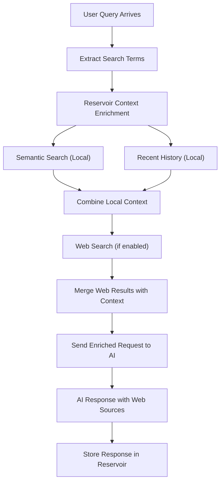

# Web Search Integration

Reservoir supports web search integration for models that provide this capability, enabling AI assistants to access real-time information from the internet while maintaining the benefits of conversational memory and context enrichment.

## Overview

Web search integration allows AI models to:

- **Access Current Information**: Get up-to-date data not in training sets
- **Verify Facts**: Cross-reference stored conversations with current sources
- **Expand Context**: Combine web results with Reservoir's semantic memory
- **Enhanced Research**: Build knowledge from both conversation history and web sources

## Supported Models

### OpenAI Models with Web Search

- **`gpt-4o-search-preview`**: OpenAI's experimental web search model
- **Future Models**: Additional web-enabled models as they become available

### Local Models

Web search capability depends on the underlying model's features:
- Some Ollama models may support web search plugins
- Custom implementations can be integrated via the API

## Usage

### Basic Web Search Request

```bash
curl -X POST "http://localhost:3017/v1/partition/research/instance/current_events/chat/completions" \
  -H "Content-Type: application/json" \
  -H "Authorization: Bearer $OPENAI_API_KEY" \
  -d '{
    "model": "gpt-4o-search-preview",
    "messages": [
      {
        "role": "user",
        "content": "What are the latest developments in renewable energy technology?"
      }
    ],
    "web_search_options": {
      "enabled": true
    }
  }'
```

### Web Search with Context

```json
{
  "model": "gpt-4o-search-preview",
  "messages": [
    {
      "role": "user",
      "content": "Based on our previous discussion about solar panels, what are the newest efficiency improvements announced this month?"
    }
  ],
  "web_search_options": {
    "enabled": true,
    "max_results": 5,
    "search_depth": "recent"
  }
}
```

## Web Search Options

### Configuration Parameters

```json
{
  "web_search_options": {
    "enabled": true,
    "max_results": 10,
    "search_depth": "comprehensive",
    "time_range": "recent",
    "include_sources": true,
    "filter_domains": ["example.com", "trusted-source.org"]
  }
}
```

### Parameter Details

| Parameter | Type | Description | Default |
|-----------|------|-------------|---------|
| `enabled` | boolean | Enable/disable web search | `false` |
| `max_results` | integer | Maximum search results to consider | `5` |
| `search_depth` | string | `"quick"`, `"standard"`, `"comprehensive"` | `"standard"` |
| `time_range` | string | `"recent"`, `"week"`, `"month"`, `"any"` | `"any"` |
| `include_sources` | boolean | Include source URLs in response | `true` |
| `filter_domains` | array | Restrict to specific domains | `[]` |

## How Web Search Works with Reservoir

### Enhanced Context Flow



### Context Prioritization

When web search is enabled, context is prioritized:

1. **User's Current Message**: Always highest priority
2. **Web Search Results**: Real-time information
3. **Semantic Context**: Relevant past conversations
4. **Recent History**: Chronological conversation flow
5. **Additional Context**: Synapse connections

## Example Workflows

### Research Assistant

```python
import openai

openai.api_base = "http://localhost:3017/v1/partition/research/instance/ai_trends"

# Initial research query
response = openai.ChatCompletion.create(
    model="gpt-4o-search-preview",
    messages=[
        {
            "role": "user", 
            "content": "What are the latest breakthroughs in large language models?"
        }
    ],
    web_search_options={
        "enabled": True,
        "time_range": "recent",
        "max_results": 8
    }
)

print(response.choices[0].message.content)

# Follow-up question (benefits from both web search and conversation history)
response = openai.ChatCompletion.create(
    model="gpt-4o-search-preview",
    messages=[
        {
            "role": "user",
            "content": "How do these breakthroughs compare to what we discussed last week about model efficiency?"
        }
    ],
    web_search_options={"enabled": True}
)
```

### News Analysis

```bash
# Get latest information
curl -X POST "http://localhost:3017/v1/partition/news/instance/tech/chat/completions" \
  -H "Content-Type: application/json" \
  -H "Authorization: Bearer $OPENAI_API_KEY" \
  -d '{
    "model": "gpt-4o-search-preview",
    "messages": [
      {
        "role": "user",
        "content": "Summarize today'\''s major technology news"
      }
    ],
    "web_search_options": {
      "enabled": true,
      "time_range": "recent",
      "max_results": 10
    }
  }'

# Follow up with context
curl -X POST "http://localhost:3017/v1/partition/news/instance/tech/chat/completions" \
  -H "Content-Type: application/json" \
  -H "Authorization: Bearer $OPENAI_API_KEY" \
  -d '{
    "model": "gpt-4o-search-preview", 
    "messages": [
      {
        "role": "user",
        "content": "How does this relate to the trends we'\''ve been tracking this month?"
      }
    ],
    "web_search_options": {
      "enabled": true
    }
  }'
```

## Response Format

### With Web Sources

```json
{
  "choices": [
    {
      "message": {
        "role": "assistant",
        "content": "Based on recent reports and our previous discussions about solar technology, here are the latest efficiency improvements:\n\n## Recent Developments\n\n1. **Perovskite-Silicon Tandem Cells**: New research published this week shows efficiency rates reaching 33.7%...\n\n2. **Quantum Dot Technology**: Scientists have achieved 15% efficiency improvements...\n\nThese developments build on your earlier questions about cost-effectiveness, and the new efficiency gains should address the concerns you raised about ROI timelines.\n\n### Sources:\n- Nature Energy, December 2024\n- MIT Technology Review, December 2024\n- Previous conversation: Solar panel efficiency discussion"
      },
      "finish_reason": "stop",
      "index": 0
    }
  ],
  "web_sources": [
    {
      "title": "Breakthrough in Perovskite Solar Cell Efficiency",
      "url": "https://www.nature.com/articles/...",
      "snippet": "Researchers achieve record-breaking 33.7% efficiency...",
      "date": "2024-12-15"
    }
  ]
}
```

## Configuration

### Environment Variables

```bash
# Enable web search by default
export RSV_WEB_SEARCH_ENABLED=true

# Configure search limits
export RSV_WEB_SEARCH_MAX_RESULTS=5
export RSV_WEB_SEARCH_TIME_RANGE=recent

# API keys for search providers (if needed)
export SEARCH_API_KEY="your-search-api-key"
```

### Per-Request Configuration

Web search can be enabled/disabled per request:

```python
# Enable for research
response = openai.ChatCompletion.create(
    model="gpt-4o-search-preview",
    messages=[{"role": "user", "content": "Current AI research trends"}],
    web_search_options={"enabled": True}
)

# Disable for private discussions
response = openai.ChatCompletion.create(
    model="gpt-4o-search-preview", 
    messages=[{"role": "user", "content": "Help me plan my personal project"}],
    web_search_options={"enabled": False}
)
```

## Use Cases

### When to Enable Web Search

**✅ Good Use Cases:**
- Current events and news
- Latest research and publications
- Real-time data (stock prices, weather, etc.)
- Technical documentation updates
- Recent product releases or updates

**❌ Avoid Web Search For:**
- Personal conversations
- Private project discussions
- Creative writing tasks
- Code debugging (unless looking for new solutions)
- Historical analysis (where training data is sufficient)

### Partition Strategies

```bash
# News and current events
/v1/partition/news/instance/tech/chat/completions

# Research and academic work
/v1/partition/research/instance/ai_papers/chat/completions

# Market analysis
/v1/partition/business/instance/market_intel/chat/completions

# Personal assistant (web search disabled)
/v1/partition/personal/instance/planning/chat/completions
```

## Performance Considerations

### Latency Impact

- **Web Search Enabled**: +1-3 seconds for search and processing
- **Web Search Disabled**: Standard Reservoir latency (200-500ms)
- **Caching**: Some web results may be cached for performance

### Cost Implications

- Web search may incur additional API costs
- Consider rate limiting for high-volume applications
- Balance between information freshness and cost

### Token Usage

Web search results count toward token limits:
- Search results are included in context token calculation
- May reduce available space for conversation history
- Automatic truncation applies when limits are exceeded

## Troubleshooting

### Web Search Not Working

```bash
# Check model support
reservoir config --get web_search_enabled

# Verify API keys
echo $OPENAI_API_KEY | wc -c  # Should be > 0

# Test with minimal request
curl -X POST "http://localhost:3017/v1/chat/completions" \
  -H "Content-Type: application/json" \
  -H "Authorization: Bearer $OPENAI_API_KEY" \
  -d '{
    "model": "gpt-4o-search-preview",
    "messages": [{"role": "user", "content": "What is today'\''s date?"}],
    "web_search_options": {"enabled": true}
  }'
```

### Search Quality Issues

1. **Refine Search Terms**: Use more specific queries
2. **Adjust Time Range**: Narrow to recent results for current topics
3. **Filter Domains**: Restrict to authoritative sources
4. **Combine with Context**: Let Reservoir's memory provide additional context

## Future Enhancements

### Planned Features

1. **Custom Search Providers**: Integration with different search APIs
2. **Search Result Caching**: Store web results for reuse
3. **Source Ranking**: Prioritize trusted sources
4. **Search History**: Track and learn from search patterns

### Integration Possibilities

1. **Domain-Specific Search**: Academic papers, patents, documentation
2. **Real-Time Data**: APIs for live information
3. **Multi-Modal Search**: Images, videos, and documents
4. **Knowledge Graphs**: Structured information integration

Web search integration transforms Reservoir from a conversational memory system into a comprehensive knowledge assistant that combines the depth of accumulated conversations with the breadth of current web information.
